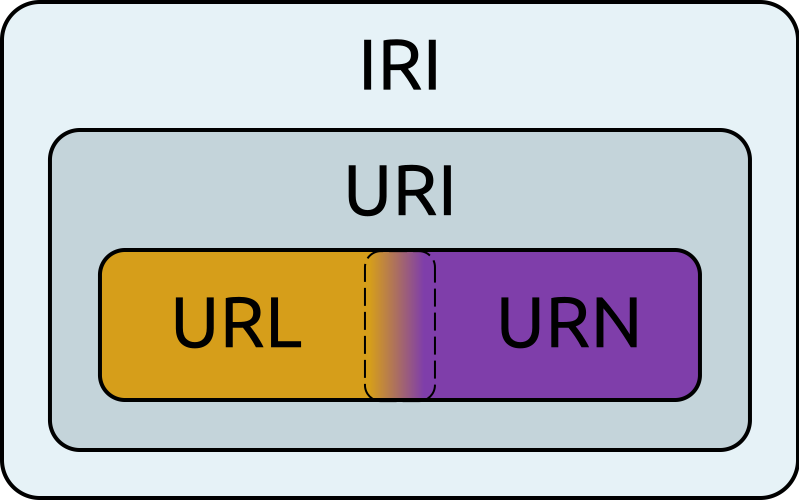

# Introduction

URIs and URLs are one of the most fundamental concepts of the web because they make it possible to reference specific resources on a network. 

* RFC 3986 (URL + URI)
* [WHATWG URL](https://url.spec.whatwg.org/#title): Followed by web browsers.

## PHP URL Parsing API

Was [introduced in PHP 8.5](https://wiki.php.net/rfc/url_parsing_api). An RFC 3986 and WHATWG URL compliant API.

* Parsing URI has a high complexity.
* Security concerns.
    * Read [Dont mix parsers](https://daniel.haxx.se/blog/2022/01/10/dont-mix-url-parsers/).
    * Remember Log4j and Log4Shell (CVE-2021-44228)
        * `jndi:ldap://127.0.0.1#.evilhost.com:1389/a` (Java Naming and Directory Interface)
    * Security white paper [EXPLOITING URL PARSERS: THE GOOD, BAD, AND INCONSISTENT ](https://web-assets.claroty.com/exploiting-url-parsing-confusion.pdf)

## URIs, IRIs, URLs, URNs

* IRI: A superset of URIs defined by RFC 3987 which allows Unicode characters to be used, therefore supporting IDNA (internationalized domain names): `https://bjørklund.com` `https://zh.wikipedia.org/wiki/中文`
* URI: A unique identifier that relates to an abstract or physical resource: `mailto:steinmb@phpbergen.no`
* URL (Uniform Resource Locator): A subset of URIs that specify their location: `https://phpbergen.no`
* URN: A subset of URIs that are globally unique within defined namespaces (e.g. urn:isbn:0451450523)

The image is reused from https://wiki.selfhtml.org/wiki/URN.

### WHATWG
A [living standard](https://url.spec.whatwg.org/#title), this is what is followed by web browsers to pare the URL.

* Lexbor - Added to PHP 8.4
* PHP uses Lexbor, written in C. https://lexbor.com/

### RFC 3986

* Is the original URL standard RFC 1738. Gave up on RFC 3987. 
* These two commonly used standards are incompatible with each other.
* PHP uses [uriparser](https://uriparser.github.io) that is a strictly RFC 3986 compliant URI parsing and handling library written in C99.

## [> URI/URL examples](../uri_examples.md)

## References

* [PHP RFC: Add RFC 3986 and WHATWG URL compliant API](https://wiki.php.net/rfc/url_parsing_api)
* [URL living standard](https://url.spec.whatwg.org/#title)

### [> Home](../README.md) > [Index](index.md)
